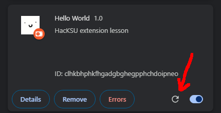

# Chrome Extensions

In this lesson, you will get an introduction to creating a Chrome extension. Extensions are fairly compatible across other browsers with minor tweaking to the main manifest.json file, but adjustments may be necessary for browser API calls, which we will get to later. For this lesson, we will be using Google Chrome as it provides a quick workflow to loading changes to an extension file. 

## Setup

1. First, create a new folder in a place that you'll remember. 
2. Navigate to this folder, create a new file within it, and name the file "manifest.json".
3. Open this file in a text editor, and paste the following contents:

```json
{
  "manifest_version": 3,
  "name": "Hello World",
  "version": "1.0",
  "description": "HacKSU extension lesson"
}
```

At this point, we have a functional extension. The manifest.json file is the heart of your Chrome extension, essentially a config file. Web browsers are a constantly evolving software, and behaviors that used to behave a certain way will eventually become deprecated. Manifest version 2 is scheduled to be deprecated in June of 2024. 

###### You may have heard about the anti-adblock changes coming to Chrome later this year (2024). As of now, Adblockers currently run on manifest version 2, and currently rely on large sets of rules (upwards of 300k) which determine whether content on a page is an ad. You can view some example rule lists [here.](https://easylist.to/) The forced upgrade to ```"manifest_version": 3``` significantly limits the number of rules that an extension can run (up to 30k), which greatly limits the effectiveness of adblockers.

For our purposes, Manifest version 3 signifies that our web extension is up to date with the latest features and web standards, but this is not necessary to develop an extension locally.

As an optional step, we can add an icon to our extension. Add an icon image file to your project somewhere within your folder (commonly within a subfolder, ```/images/```), and add the following to the manifest.json file.

```json
"icons": {
    "128": "[your-image-path-here]"
  },
```

In my case, I use ```"128": "images/icon128.png"```
You can specify multiple icon sizes if you wish (128, 48, 32, 16).

4. Save the manifest.json file.
5. Paste ```chrome://extensions``` in your address bar and enter. This is the main page we will be visiting to manage our extensions. 

[](setup1.png)

6. Enable the "Developer mode" toggle on the top right. If this is not enabled, you cannot load custom extensions.
7. Click the now visibile "Load unpacked" button on the top left. In the file explorer, locate the folder that you created in step 1.

[](setup2.png)

We have now enabled our extension. Currently, this extension is doing nothing. But we'll add some functionality soon. 

##### You can disable this extension at any time by clicking the toggle at the bottom right of our extension item.

## Adding functionality

### Editing an existing page

Let's create a script that runs on a webpage. We will first need to make some modifications to our manifest.json file to tell Chrome to give us this permission.

1. Place a comma after the last key-value pair item of our manifest, and then paste the following key-value pairs, before the ending bracket.

```json
"content_scripts": [
    {
      "matches": [
        "https://www.example.com/"
      ],
      "js": [
        "script.js"
      ]
    }
  ]
```

"content_scripts" allows your extension to inject scripts into existing web pages. You specify what script file you will use within "js", and all pages that this script should modify within "matches."
With these key-value pairs, we are telling Chrome that we want to run all JavaScript files in the list within the key "js", on all websites listed within the "matches" key.

###### Note: Despite these keys having one value each, these square brackets are __NOT__ optional. JSON syntax does not support type coersion between one-element lists and strings.

Now, it is time to create our script.

2. Create a new file within the folder you created at the start of the lesson, and name the file ```script.js```.

3. Place the following JavaScript code within the file, and save.

```js
alert("buzz buzz");
```

Our extension is ready for testing.

4. Navigate to the [extensions page](chrome://extensions) and refresh the extension (Bottom right of the extension, next to the toggle).

[](functionality0.png)

We will need to hit the refresh button each time that we make a change to our extension. I'd recommend keeping this extensions page open in one of your tabs.

For now, we've only configured our extension to run on https://www.example.com. In the future, if you wish to run a script on all websites, you can replace the URL with the token ```"<all urls>"```

5. Visit https://www.example.com, you will be greeted by an alert.

[](functionality1.png)

In addition to dialogues, we can also inject HTML elements into the page, or alter the appearance of existing content. Append the following to the JavaScript file:

```js
// hide p element
const hideMe = document.getElementsByTagName("p");
for (const e of hideMe) {
    e.style.display = 'none';
}
```
Saving our changes, the p elements in our document are no longer visible. 

Let's try something more fun. [CSS has a couple of built-in filters](https://developer.mozilla.org/en-US/docs/Web/CSS/filter), which we can choose to apply to the entirety of the loaded webpage.

```js
// invert the page colors
document.documentElement.style.filter = 'invert(100%)';
```

After saving our extension, the entire page inverts colors once the page loads.

Let's inject an image into the page.

6. Add the following to manifest.json, and be sure to replace ```[image-path-here]``` with whatever path your image uses.

```json
"web_accessible_resources": [
    {
      "resources": [
        "[image-path-here]"
      ],
      "matches": [
        "<all_urls>"
      ]
    }
  ]
```

In this example, we are using the ```<all_urls>``` keyword to modify the appearance of all pages. If you do not wish to do this, you can replace this with a specific URL as done earlier in the lesson.

7. Add the following to ```script.js```, again, replace ```[image-path-here]``` with the path to your image. ```${chrome.runtime.id}``` brings you to the base folder of your extension.

```js
// overlay an image on the center of the page
let img = document.createElement('img');
img.src = `chrome-extension://${chrome.runtime.id}/[image-path-here]`;
img.style.cssText = `
    position: fixed;
    top: 50%;
    left: 50%;
    transform: translate(-50%, -50%);
    z-index: 9999;
`;
document.body.appendChild(img);
```

Save and reload the extension. 

[](functionality2.png)


### Creating a popup

Many extensions have a dialog that appears when an extension's icon is clicked.

1. We first need to add a new key-value pair in our ```manifest.json``` file.

```json
"action": {
    "default_popup": "popup.html"
  }
```

This specifies the page that opens when the extension icon is clicked in the browser toolbar.
Now, we need to create the popup page. 

2. Create a new file (within the folder created at the beginning) and name it ```popup.html```. Open the file with any text editor, and add the following HTML:

```html
<h1>:)</h1>
```

Make sure all of your files are saved. 
When reloading our extension and clicking on the icon (you may need to find your extension by clicking the "puzzle piece" icon and pinning it to your toolbar) we should see the following:

[](popup1.png)

Let's add a second page to navigate to within our popup.

3. Append ```popup.html``` with the following:

```html
<a href="popup2.html">Go to a new page</a>
```

4. Create new file, and name it ```popup2.html```. Open the file and add the following HTML:

```html
<p>You found me!</p>
<a href="popup.html">Go back</a>
```

We now are able to switch between two pages of our extension.

5. Let's try adding the following link (it will not work just yet)

```html
<a href="https://hacksu.com/cute_puppy.jpg">Feel better!</a>
```

We can open a link in a new tab by adding ```target="_blank"``` to our HTML element, however, maybe we want to open a link in the current browser tab?

To do this, we need access the [tabs Chrome extension API](https://developer.chrome.com/docs/extensions/reference/api/tabs).

4. Add the following to the ```manifest.json``` file to grant permission to use the "tabs" API.

```json
"permissions": [
    "tabs"
  ],
```

This allows us to use methods such as ```chrome.tabs.create()```, which requires JavaScript to execute.

5. Create a new file, ```popup.js```, and reference this new file at the bottom of popup.html.

```html
<h1>:)</h1>
<a href="popup2.html">Go to a new page</a>
<a href="https://hacksu.com/cute_puppy.jpg">Feel better!</a>

<script src="popup.js"></script>
```

6. Within popup.js, add the following code:

```js
// bind the link element to Chrome new tab event
window.addEventListener('click', (e) => {
    if (e.target.href !== undefined) {
        chrome.tabs.update({ url: e.target.href })
    }
})
```

You don't need to understand all of this code. In a nutshell, this code is checking if a clicked element has an href attribute, and if so, passes that value to the current active Chrome tab. 

However, a side effect of this code is that it causes unwanted side effects to the functionality of our previous link. One way to differentiate this behavior is by qualifying classes to your elements, and checking for the existence of this qualifier.

7. Update the JavaScript code in ```popup.js``` as follows:

```js
// bind the link element to Chrome new tab event
window.addEventListener('click', (e) => {
    if (e.target.href !== undefined && e.target.classList.contains("current-tab")) {
        chrome.tabs.update({ url: e.target.href })
    }
})
```

and our HTML element:

```html
<a href="https://hacksu.com/cute_puppy.jpg" class="current-tab">Feel better!</a>
```

Now, we are able to differentiate our links depending on behavior needed.

## Putting it all together

1. Modify the permissions to your manifest.json file.

```json
"permissions": [
    "tabs",
    "activeTab",
    "scripting"
  ],
```
2. Add a button element to your popup.html file, and give it an id

```html
<button id="invert">Invert</button>
```

3. Add the following code to your popup.js

```js
// add functionality to invert button
document.getElementById('invert').addEventListener('click', () => {
    // query active tabs
    chrome.tabs.query({ active: true, currentWindow: true }, tabs => {
        // execute script to invert colors
        chrome.scripting.executeScript({
            // target the active tab
            target: { tabId: tabs[0].id },
            function: () => {
                let filterValue = document.documentElement.style.filter;
                if (filterValue.includes('invert')) {
                    document.documentElement.style.filter = 'none';
                } else {
                    document.documentElement.style.filter = 'invert(100%)';
                }
            }
        });
    });
});
```

Now, we can press a button on our popup and have it modify the current tab appearance.

## Explore the great beyond!

If you wish to explore extension development further, one of the easiest ways to do so is to mess with existing extensions. You can find some example extensions on the [Chrome Extensions documentation page](https://developer.chrome.com/docs/extensions/samples). 

1. Find a project that seems interesting to you. 

2. Clone the repo here: https://github.com/GoogleChrome/chrome-extensions-samples.git

3. Load the unpacked extension in your browser, look at the code behind it, see if you can follow along with what makes it work, and experiment with modifications to change its functionality.

Happy hacking!