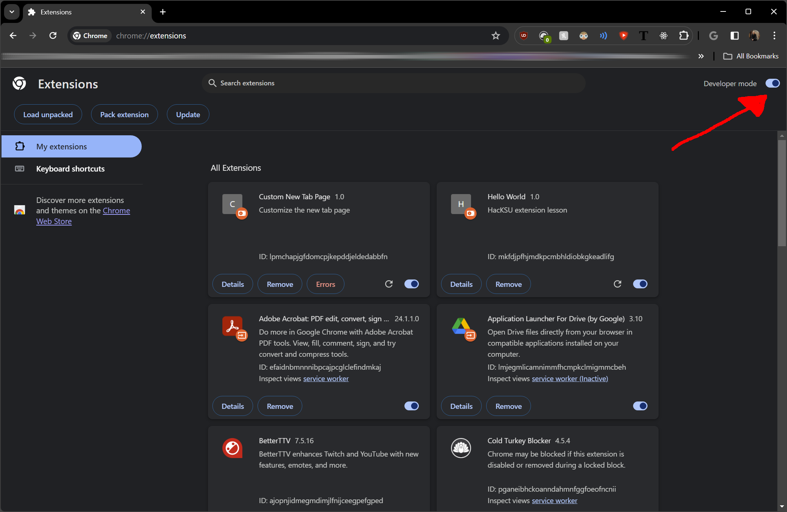
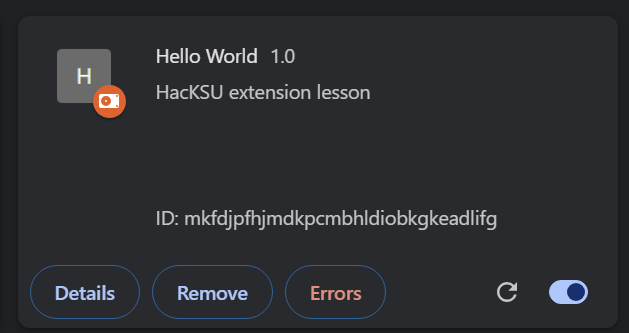
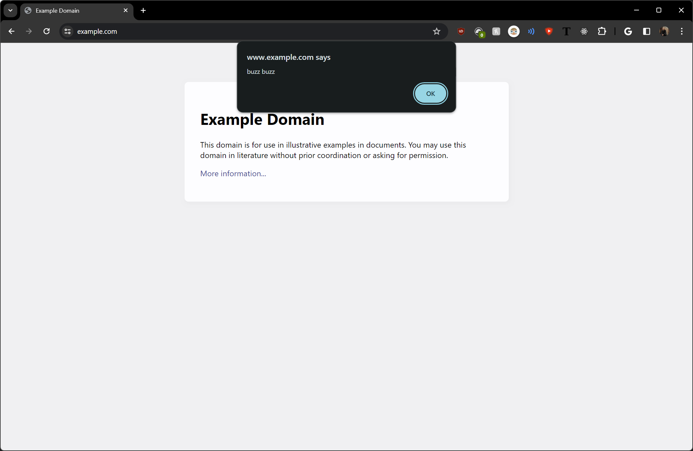
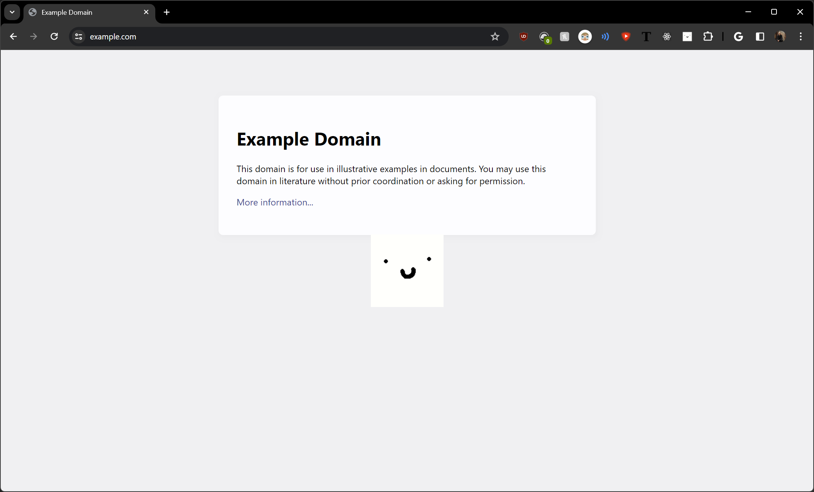
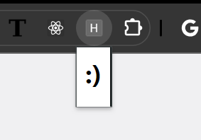

# Chrome Extensions

In this lesson, you will get an introduction to creating a Chrome extension. Extensions are fairly compatible across other browsers with minor tweaking to the main manifest.json file. For this lesson, we will be using Google Chrome as it provides a quick workflow to loading changes to an extension file. 

## Setup

1. First, create a new folder in a place that you'll remember. 
2. Navigate to this folder, create a new file within it, and name the file "manifest.json".
3. Open this file in a text editor, and paste the following contents:

```json
{
  "manifest_version": 3,
  "name": "Hello World",
  "version": "1.0",
  "description": "HacKSU extension lesson"
}
```

The shell of our extension is complete. So, first thing to note here. Web browsers are a constantly evolving software, and behaviors that used to behave a certain way will eventually become deprecated. Manifest version 2 is scheduled to be deprecated in June of 2024. 

You may have heard about the anti-adblock changes coming to Chrome later this year (2024). As of now, Adblockers currently run on manifest version 2, and currently rely on large sets of rules (upwards of 300k) which determine whether content on a page is an ad. You can view some example rule lists [here.](https://easylist.to/) The forced upgrade to ```"manifest_version": 3``` significantly limits the number of rules that an extension can run (up to 30k), which greatly limits the effectiveness of adblockers.

For our purposes, Manifest version 3 signifies that our web extension is up to date with the latest features and web standards, but this is not necessary to develop an extension locally.

As an optional step, we can add an icon to our extension. Add an icon image file to your project, and add the following to the manifest.json file.

```json
"icons": {
    "128": "[your-image-path-here]"
  },
```

You can specify multiple icon sizes if you wish (128, 48, 32, 16).

4. Save the file.
5. Paste ```chrome://extensions``` in your address bar and enter. This is the main page we will be visiting to manage our extensions. 

[](setup1.png)

6. Enable the "Developer mode" toggle on the top right. If this is not enabled, you cannot load your own extensions.
7. Click the now visibile "Load unpacked" button on the top left. In the file explorer, locate the folder that you created in step 1.

[](setup2.png)

We have now enabled our extension. Currently, this extension is doing nothing. But we'll add some functionality soon. 

You can disable this extension at any time by clicking the toggle at the bottom right of our extension item.

## Adding functionality

### Editing an existing page

Let's create a script that runs on a webpage. We will first need to make some modifications to our manifest.json file to tell Chrome to give us this permission.

1. Place a comma after the last key-value pair item of our manifest, and then paste the following key-value pairs, before the ending bracket.

```json
"content_scripts": [
    {
      "matches": [
        "https://www.example.com/"
      ],
      "js": [
        "script.js"
      ]
    }
  ]
```

With these key-value pairs, we are telling Chrome that we want to run all JavaScript files in the list within the key "js", on all websites listed within the "matches" key.

##### Note: Despite these keys having one value each, these square brackets are __NOT__ optional. JSON syntax does not support type coersion between one-element lists and strings.

Now, it is time to create our script.

2. Create a new file within the folder you created at the start of the lesson, and name the file ```script.js```.

3. Place the following JavaScript code within the file, and save.

```js
alert("buzz buzz");
```

Our extension is ready for testing.

4. Navigate to the [extensions page](chrome://extensions) and hit the refresh button on our extension.

For now, we've only configured our extension to run on https://www.example.com. In the future, if you wish to run a script on all websites, you can replace the URL with the token ```"<all urls>"```

5. Visit https://www.example.com, you will be greeted by an alert.

[](functionality1.png)

In addition to dialogues, we can also inject HTML elements into the page, or alter the appearance of existing content. Append the following to the JavaScript file:

```js
// hide h1 element
const hideMe = document.getElementsByTagName("h1");
for (const e of hideMe) {
    e.style.display = 'none';
}
```
Saving our changes, the "Example Domain" header element is no longer visible. 

Let's try something more fun. [CSS has a couple of built-in filters](https://developer.mozilla.org/en-US/docs/Web/CSS/filter), which we can choose to apply to the entirety of the loaded webpage.

```js
// apply a random blur effect and color filter every second
setInterval(function () {
    var hueRotateDegrees = Math.floor(Math.random() * 361);
    var blurStrength = Math.floor(Math.random() * 10);
    document.documentElement.style.filter = `hue-rotate(${hueRotateDegrees}deg) blur(${blurStrength}px)`;
}, 1000);
```

After saving our extension, the appearance of the page changes dramatically, with a random hue and blur effect applied each second. Let's inject an image into the page.

6. Add the following to manifest.json, and be sure to replace ```[image-path-here]``` with whatever path your image uses.

```json
"web_accessible_resources": [
    {
      "resources": [
        "images/[image-path-here]"
      ],
      "matches": [
        "<all_urls>"
      ]
    }
  ]
```

7. Add the following to ```script.js```, again, replace ```[image-path-here]```.

```js
// overlay an image on the center of the page
let img = document.createElement('img');
img.src = `chrome-extension://${chrome.runtime.id}/images/[image-path-here]`;
img.style.cssText = `
    position: fixed;
    top: 50%;
    left: 50%;
    transform: translate(-50%, -50%);
    z-index: 9999;
`;
document.body.appendChild(img);
```

Save and reload the extension. 

[](functionality2.png)


### Creating a popup

Many extensions have a dialog that appears when an extension's icon is clicked.

1. We first need to add a new value in our ```manifest.json``` file.

```json
"action": {
    "default_popup": "popup.html"
  }
```

Now, we need to create the popup page. 

2. Create a new file (within the folder created at the beginning) and name it ```popup.html```. Open the file with any text editor, and add the following HTML:

```html
<h1>:)</h1>
```

Make sure all of your files are saved. 
When reloading our extension and clicking on the icon (you may need to find your extension by clicking the "puzzle piece" icon and pinning it to your toolbar) we should see the following:

[](popup1.png)

It may seem like you can just use normal HTML. However, certain behaviors, such as inserting a link is more complicated, and which will tie us into into Chrome extension APIs. 

3. Let's try adding the following link (it will not work just yet)

```html
<a href="https://hacksu.com/cute_puppy.jpg">Feel better!</a>
```

Normally, we can open a link in a new tab using ```target="_blank"```, however, this is does not work for our popup window. To add a link, we need access the [tabs Chrome extension API](https://developer.chrome.com/docs/extensions/reference/api/tabs).

4. Add the following to the ```manifest.json``` file

```json
"host_permissions": [
    "tabs"
  ],
```

This allows us to use methods such as ```chrome.tabs.create()```, which requires JavaScript to execute.

5. Create a new file, ```popup.js```, and reference this new file at the bottom of popup.html.

```html
<h1>:)</h1>
<a href="https://hacksu.com/cute_puppy.jpg">Feel better!</a>

<script src=popup.js></script>
```

6. Within popup.js, add the following code:

```js
window.addEventListener('click', (e) => {
    if (e.target.href !== undefined) {
        chrome.tabs.create({ url: e.target.href })
    }
})
```

You don't need to understand all of this code. In a nutshell, this code is checking if a clicked element has an href attribute, and if so, is passing that value to the new chrome tab. Now that we have set this up once, we can declare multiple ```<a>``` elements on the page and each will deliver to the corresponding destination.

However, if we wish for some links to pass the user to another page in our web extensions folder, this code is not sufficient. One way to differentiate this behavior is by qualifying classes to your elements, and checking for the existence of this qualifier.

```js
window.addEventListener('click', (e) => {
    if (e.target.href !== undefined && e.target.classList.contains("new-tab")) {
        chrome.tabs.create({ url: e.target.href })
    }
})
```

and our HTML element:

```html
<a href="https://hacksu.com/cute_puppy.jpg" class="new-tab">Feel better!</a>
```